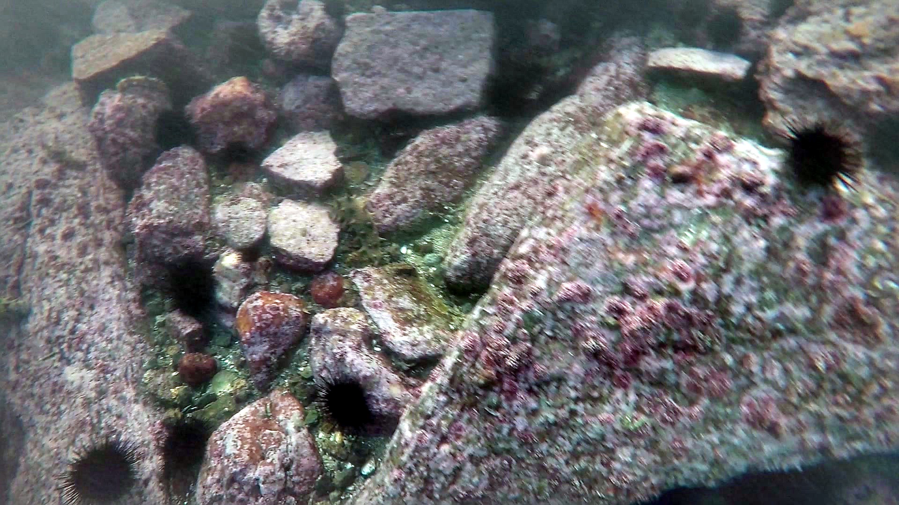
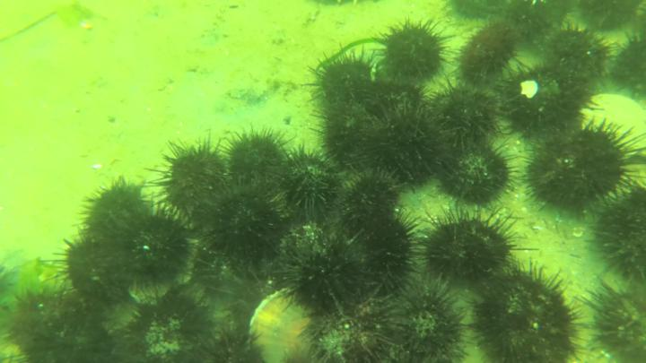
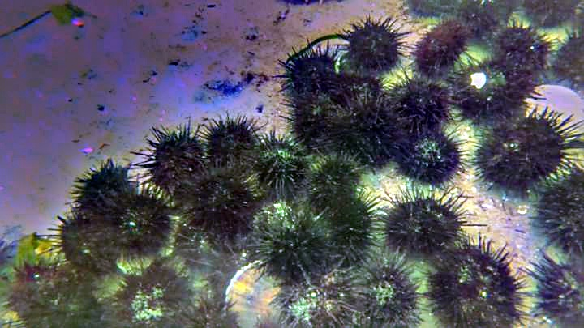

# ACE_CuPy


This is *an* *unofficial* implementation with python of [**Automatic color enhancement (ACE) and its fast implementation**](https://www.ipol.im/pub/art/2012/g-ace/).

The C/C++ implementation [code](https://www.ipol.im/pub/art/2012/g-ace/ace_20121029.tar.gz) is also showed on the paper website.

And this repo use `CuPy` to accelerate the algorithm. [CuPy](https://cupy.dev/) is **NumPy-like API accelerated with CUDA**


## Requirement


You can make the conda env from reqiurement.txt.  
```sh
conda create --name <env> --file reqiurement.txt
```

or install in existing environment

```sh
conda install --yes --file requirements.txt
```

If you want to install in manual, you must install the list packages as below:

```sh
pip install numpy opencv-python cupy-cuda101
```

This version only support for `gpu`, and should install the `cudatoolkit` and `cudnn`


## Usage
``` sh
python demo.py
```

or just call the api as below:  
 
``` python
import cv2
from ACE_cupy import ACE_cpColor

img1 = cv2.imread('data/000001.jpg')
img1_enhance = ACE_cpColor(img1)
cv2.imwrite('assets/1_enhance.jpg', img1_enhance)
```

## Performance

I use the code to enhance `underwater images`.



